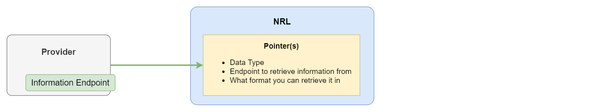

# Introduction

The National Record Locator (NRL) has been developed primarily to enable healthcare professionals to locate and access patient information shared by other healthcare organisations, to support the direct care of those patients.

Sharing of information through the NRL also empowers professionals, patients and communities, strengthens primary, secondary, and acute care and allows for efficiencies to be made.

### Actors

Information sharing is made up of three actors:

- **Providers** who hold information about patients and wish to share it with others
- **Consumers** who would benefit from having access to the information being shared by providers
- The **NRL** which enables consumers to locate information shared by the providers

### Enabling Information Sharing

The NRL has been built to facilitate national sharing of information, enabling consumers to:

- identify which providers hold and are sharing information
- know how to retrieve the information, where from and in what format
- know how to authenticate and get authorisation to access the information

The NRL removes the need for organisations to create duplicate copies of information across systems and organisations, by facilitating access to up-to-date information directly from the source.

# How The NRL Works

The NRL is a national [index](architectural_overview.html) of [pointers](pointer_overview.html) to information held by providers.

### Providers Create Pointers

Providers create and manage [pointers](pointer_overview.html) on the NRL to say what [types](record_type_overview.html) of information they hold and are sharing, what formats that information can be retrieve in, where to go to retrieve the information and the authentication method required to get that information.

### Consumers Find And Use Pointers

When a consumer would benefit from having information shared by other organisations, for example about a patient, they can search the NRL and retrieve all known [pointers](pointer_overview.html) related to that patient. From the information within the pointers, the consumer can decide if any of the [types](record_type_overview.html) of information being shared by the providers may be of interest. They can then use the information in the pointers to retrieve the patient's information directly from the associated provider.

More detail about the NRL and how to interact with the service can be found on the [Architectural Overview](architectural_overview.html) page.

## Supported Pointer types

The list of pointer types currently supported by the NRL can be found on the [Pointer Types](supported_pointer_types.html) page.
